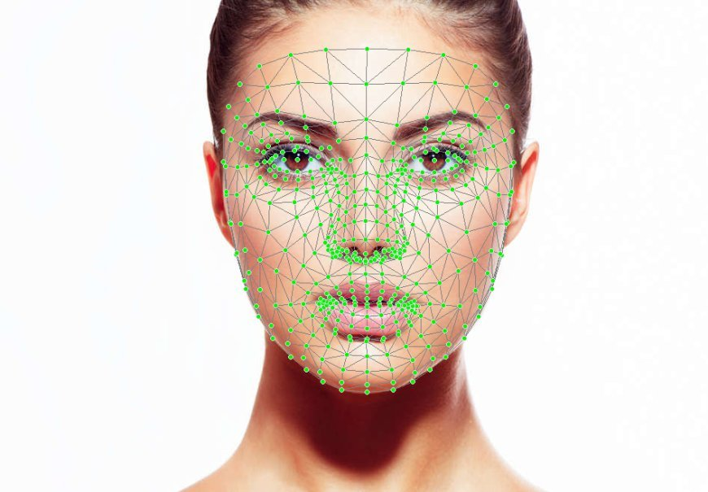
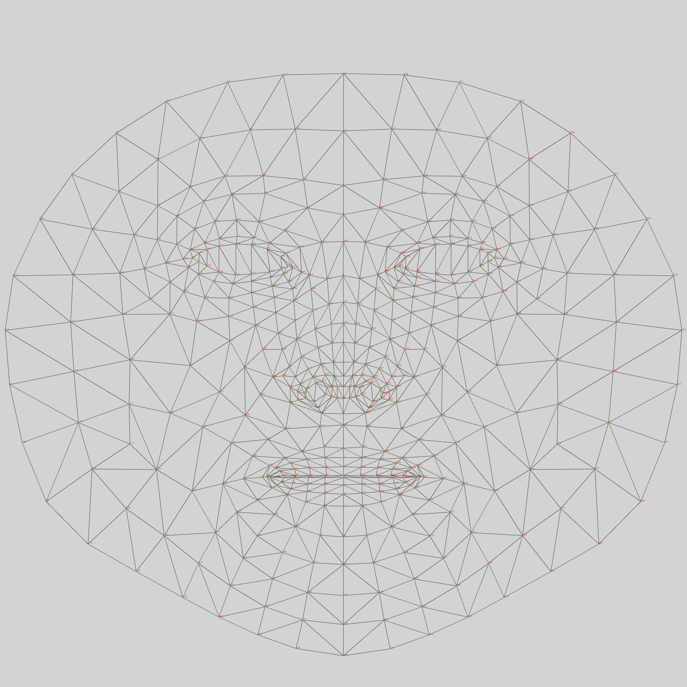

# LUNG MESH

## Objective:-

Using deep learning to create a preprocessing module that aligns 2D X-rays to a standard geometric frame by aligning them to a fixed-resolution canonical frame reducing input variability and improve training for downstream models.

### Project Title

End-to-End Geometric Canonicalization for 2D Chest X-Ray Preprocessing and Downstream Robustness

#### Problem Statement

Inter-patient anatomical variance, posture shifts, and framing discrepancies in 2D chest X-rays introduce high input noise, degrading the performance and generalization of downstream computer-aided diagnosis (CAD) models. Current preprocessing relies on heuristic resizing or rigid cropping, which fails to correct rotational, scaling, and structural alignment inconsistencies.

#### Proposed Solution

Develop a deep learning-based spatial alignment module that automatically maps raw 2D radiographs into a standardized, fixed-resolution canonical frame. Using a differentiable Spatial Transformer Network (STN) guided by key anatomical landmarks, the module normalizes orientation, scale, and translation dynamically.

#### Motivation

Disease and anomaly detection using U-Net is a key use case of AI in the medical field. We need to train the AI models as quickly as possible with the highest accuracy. Using a good structured dataset is a pivotal factor in model training. Human body. The X-ray can be performed on infants, and on elders above the age of 60. It is possible that their body shape is slightly deviated from the ideal outline of a chest.  
For infants, the size of the chest and lungs will be much smaller with respect to the frame of the image. It is also possible that the test subject is slightly off-center or rotated in the frame. These small errors compound while training the AI model. In this paper, we propose an algorithm to perform preprocessing on the dataset that will be used for training the AI model.

## Baseline

Objective: To set up a baseline of the error experienced by machine learning models, such as diffusion models, while training on raw X-ray images before canonicalization.

## Phase 1

To develop Lung Mesh, we take inspiration from the Mediapipe Face Mesh. It is a machine learning system developed by Google for real-time facial landmark detection. It identifies 468 three-dimensional landmarks across the human face using a single camera without requiring a depth sensor. The system first detects the face and then estimates the position of these landmarks to construct a 3D facial mesh.

### Images

### Papers

[Lung Segmentation in Chest Radiographs Using Anatomical Atlases With Nonrigid Registration](https://www.researchgate.net/publication/258635659_Lung_Segmentation_in_Chest_Radiographs_Using_Anatomical_Atlases_With_Nonrigid_Registration)

[Development of a Digital Image Database for Chest Radiographs With and Without a Lung Nodule](https://www.ajronline.org/doi/pdf/10.2214/ajr.174.1.1740071)

### Outline

<!-- - Create a baseline of the training error with a un-normalized dataset. -->

Steps to proceed -

1. Figure out how to implement a thorax detector (similar to a face-detector)
2. Build bounding rectangles
3. Basic outline landmarks

### Binarization

To detect thorax and to create a bounding box, first we try to binarize the black-and-white X-ray image.

#### Problem faced -

1. Different X-ray images are of different brightness, so it is difficult to set a constant threshold value for binarization.
2. Even if we are able to binarize the image, the patient's left lung (right lung when viewed from our side) is skewed because of the presence of the heart. Hence, it is impossible to get an exact boundary between the heart and lungs at the junction.
3. Even for the position of the lungs with respect to the lateral walls of the chest, it is difficult to capture the position of the lungs after binarization.

_**Hence, the decision was taken to not use binarization or similar techniques before finding the bounding box.**_

### Edge detection

We can use edge detection techniques by using various kernels and/or Canny edge detectors to find the edges in the X-ray image. This might help us in getting a better idea about where the boundaries of the lungs and the other organs are situated within the chest.

#### Challenges faced -

1. We cannot use Canny or Sobel edge detection algorithms because they rely on a binary image. Since we were unable to binarize the image, Canny and Sobel filters perform extremely badly.
2. The X-ray images are continuous and real-world images, which are grayscale, not black and white. The gradient is very low between the black and white portions. The gradual shading between the black and white parts, with no well defined boundary, poses a major challenge for edge detection.

#### Solution proposed -

1. We perform preprocessing on the raw X-ray image to make the gradients more pronounced. We used the function -

$$
I'(x)=255-\left|255-2I(x)\right|
$$

where I(x) is the original grayscale intensity and I'(x) is the transformed intensity.
This custom transformation was found to be more effective for the specific objective of enhancing Canny edge detection in the evaluated X-ray images. It was motivated by the hypothesis that amplifying intensity transitions would improve the detection of anatomical boundaries.

## Phase 2

### Steps to proceed

The process will include three major steps:

1. Rotation
2. Horizontal Alignment
3. Scaling
4. Vertical Alignment

For phase 2, we will focus mainly on alignment and scaling.

### Horizontal Alignment

The objective of this code is to Center align the X-ray image. It is possible that the image is off-center, so we will use this score to bring the image to the center.
We do this by making the chest X-ray is symmetric about the vertical axis. That means when we flip the image left to right, the image should be more or less symmetrical.  
  
#### How it works:-

We iteratively remove two columns of pixels from the right on each turn, and then we will flip the image left to right and compare its deviation (that is, the difference between the image before and after getting flipped). Then we will add a single column of black pixels to the right and a single column of black pixels to the left. We continue this until the error is lesser than twice* the minimum error achieved yet.
We repeat the same process for the left side as well  
  
(* Can be adjusted to reduce the compute time. If it is kept too high, suppose 3 or 4 times, then we might end up checking all the pixels in the image. If we keep it too low, suppose 1.01 times, then we might end up assuming zero movement to either left or right as the best option. )

### Scaling

Often, we find X-ray images where the target might be an infant, and the lungs of the patient are located towards the upper half of the image. Hence, we can perform scaling to bring uniformity amongst all the X-ray images, irrespective of the size or shape of the lungs.

For the scaling, we will first use a 2D U-net model to identify the exact position of lungs in the X-ray image. Following are the sources -

* [Kevin Scott Mader - Training U-Net on TB Images to Segment Lungs on Kaggle](https://www.kaggle.com/code/kmader/training-u-net-on-tb-images-to-segment-lungs/)  
* [Eduardo Mineo - U-Net lung segmentation (Montgomery + Shenzhen) on Kaggle](https://www.kaggle.com/code/eduardomineo/u-net-lung-segmentation-montgomery-shenzhen)

Instead of training a new model, we can directly use the segmentation model trained by them. The UNet lung segmentation model was trained on two small datasets: the Montgomery dataset and the Shenzhen frontal X-ray dataset. These datasets are generally used for tuberculosis-related abnormalities detection. This model will be used as a foundation to identify the lung as well as to build a bounding box around our organs of interest.  
After creating the bounding box for the target image, we can perform scaling such that the position and proportion of the area of interest (lungs in particular) is similar for all images in the dataset.

#### Choice of position and proportion -

After performing alignment, we have already fixed the horizontal position of the image. To fix the vertical position of the image, we draw inspiration from the photographic principles. We will try to make sure that the lung covers two-thirds of the vertical height of the whole image. <!-- However, the volume of the lungs in the image is also a point of concern, but it will be dealt with in phase 3. -->

#### Problems faced -

1. Resolution - If the original image is of 64 x 64 dimensions and we try to zoom in on a particular section of the image; the image may get pixelated.
2. Asymmetry - It is possible that the lungs are not symmetrical. Biology dictates that the right lung on the X-ray is slightly bulged inwards due to the position of the heart. This may cause the left lung to elongate downwards or may not be in the ideal shape.

#### Solution Proposed -

1. Since we are working on large images of dimensions 2048 x 2048, the image can be zoomed. However, the model that we are using was trained on a 512 x 512 image dataset. So even if we take a 1/16th part of the image, our model will be able to successfully segment the lungs apart from the background X-ray.

### Vertical Alignment

Now that we have established that the lung's vertical height is two-thirds of the total height of the image, we will now translate the lungs in the vertical direction.  
Here, we can go through any of the two routes:

1. Moving the bounding box of the lungs so that they touch the top edge of the image.
    * We have empirically determined that many bounding boxes already touch the top edge of the frame, it would be computationally simpler to perform no actions on them.
2. Translating the image vertically down such that the bounding box is located one-sixth of the total height from above as well as from below.
